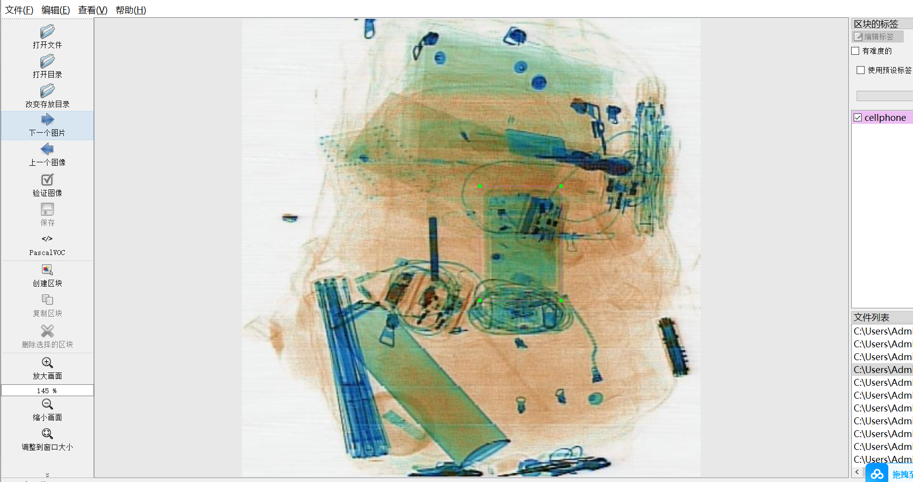
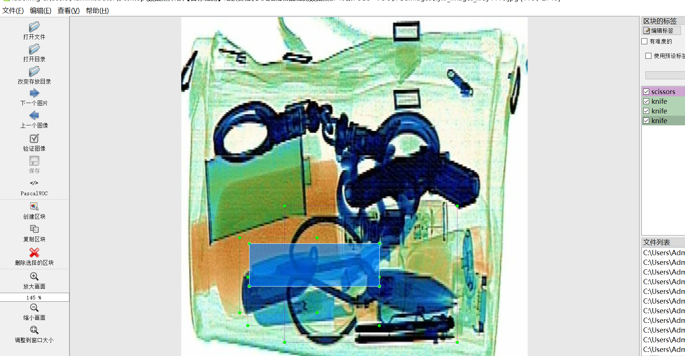
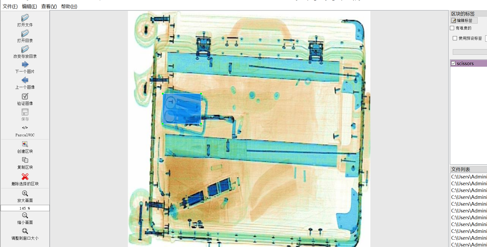
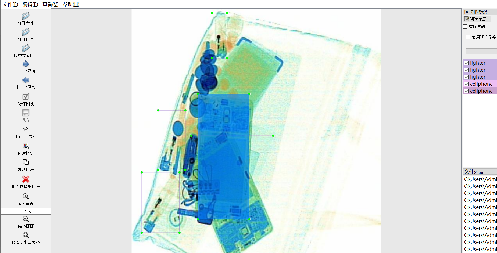
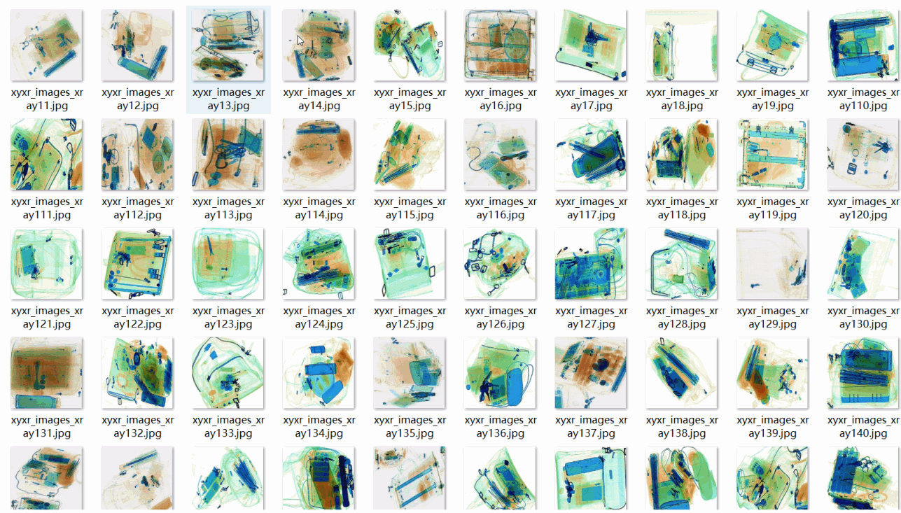

# [Object Detection] Subway Security Check Machine XLight Hazard Item Detection Dataset 2749 imagesYOLO+VOC

Dataset Format: Pascal VOC + YOLO (excluding the split-path txt file; only jpg images with corresponding VOC-format xml files and YOLO-format txt files)

The compressed file contains: three folders, each storing images, xml files, and text files.

The total number of jpg images in the JPEGImages folder is 2749.

The total number of XML files in the "Annotations" folder: 2749.

The total number of txt files in the labels folder is 2749.

Number of tag types: 8

Tags: ["camera", "cellphone", "electronic", "knife", "laptop", "lighter", "powerbank", "scissors"]

The number of boxes for each label (Note that the order of labels in the Yolo format does not correspond to this, but is based on the classes.txt file in the labels folder):

Camera Frame Count = 37 (Camera)

【】『』「」<>[]

Electronic frame count = 49 (electronic device)

Knife Frames = 634 (knives)

Laptop Frame Count = 713 (Laptop)

lighter frame count = 1471 (lighter)

【 】『』「」<>[]

【】『』「」<>[]

Total frame count: 4703

Picture clarity (Resolution: Pixels): Clear

Is the image enhanced: No

Shape of the label: Rectangular box, used for object detection and recognition.

Important Note: None

Special Notice: This dataset does not guarantee the accuracy or precision of the trained models or weight files. The dataset only provides accurate and reasonable annotations.
## Images

---

Here is a pay link on Stripe (https://buy.stripe.com/3cs8yP7sY87d0vu9AB). Please contact me lonlonago@foxmail.com after funding $89, and I will send you a complete data files, thank you!

